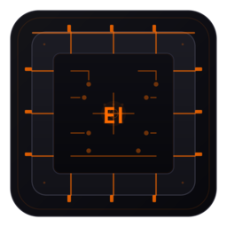

# EmbedIDE

**Modern Engineering IDE for Embedded Development**



A cross-platform desktop IDE for embedded systems development, built with Electron, React, and CodeMirror. Supports Rust, C, and C++ for ARM Cortex-M microcontrollers.

## Features

- ✏️ **Multi-language Editor** — Syntax highlighting for Rust, C, C++ with CodeMirror 6
- 🧩 **Project Templates** — Quick-start projects for STM32 (Rust, C, C++, Assembly)
- 🔧 **Build & Flash** — One-click build and flash via OpenOCD
- 📟 **Serial Monitor** — Built-in serial terminal
- 📊 **Memory Analyzer** — Real-time flash/RAM usage visualization
- 🎨 **Themes** — 10 built-in themes (dark & light)
- 🌍 **Multi-language UI** — English, Russian, Chinese, Japanese, German, French
- 🔍 **File Search** — Full-text search across project files
- 🖥️ **Frameless Window** — Modern custom title bar with minimize/maximize/close

## Requirements

- **Node.js** 18+
- **npm** or **yarn**
- Platform: **Linux** (primary), **Windows**, **macOS**

### For Embedded Development

- `arm-none-eabi-gcc` — ARM GCC toolchain (for C/C++ projects)
- `rustc` + `cargo` — Rust toolchain (for Rust projects)
- `openocd` — On-chip debugger/flasher (for flashing)

## Quick Start

```bash
# Clone
git clone https://github.com/anomalyco/EmbedIDE.git
cd EmbedIDE

# Install dependencies
npm install

# Development mode
npm run dev

# Production build
npm run launch
```

## Build Distribution

Build installers for your platform:

```bash
# Linux (AppImage + deb)
npm run dist:linux

# Windows (NSIS installer)
npm run dist:win

# macOS (DMG)
npm run dist:mac

# All platforms
npm run dist:all
```

Outputs will be in the `release/` directory.

### Icon Generation

If you need to regenerate icons from the SVG source:

```bash
# Requires ImageMagick
convert -background none -density 512 public/icon.svg -resize 256x256 public/icon.png
```

## Project Structure

```
EmbedIDE/
├── electron/          # Electron main process
│   ├── main.js        # Window, menu, IPC
│   ├── preload.js     # Context bridge API
│   ├── project.js     # File management
│   ├── toolchain.js   # Build & flash
│   └── serial.js      # Serial port
├── src/               # React frontend
│   ├── App.tsx        # Main layout
│   ├── main.tsx       # Entry point
│   ├── themes/        # Theme system
│   ├── ui/            # UI components
│   └── core/          # Types, utils, translations
├── public/            # Static assets
├── build/icons        # Icon assets
├── package.json
└── vite.config.ts
```

## Themes

| Theme | Type |
|-------|------|
| Dark Engineering | Dark (default) |
| Light Engineering | Light |
| Green Engineering | Dark |
| Burgundy | Dark |
| Red Alert | Dark |
| Amber Glow | Dark |
| Cyberpunk | Dark |
| Ocean Deep | Dark |
| Nord | Dark |
| Catppuccin | Dark |

## License

MIT
